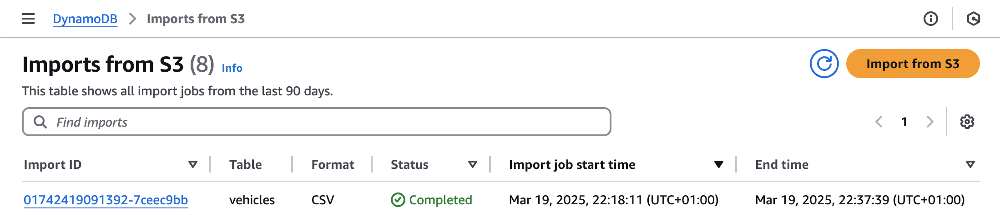

# CloudFormation DynamoDB Import from S3

This project demonstrates how to import data from a CSV file in S3 to a DynamoDB table using CloudFormation.

## Overview

I have used the [vehicle-csv-generator](https://github.com/dennysfredericci/vehicle-csv-generator) to generate a CSV file with five million records. 

The CSV file was uploaded to an S3 bucket, and the data was imported into a DynamoDB table using CloudFormation.

This test with five million records, took 19 minutes to complete.



**Note:** During the Amazon S3 import process, DynamoDB creates a new target table for the import. Importing into existing tables is not currently supported. For more details, refer to the [DynamoDB S3 Data Import documentation](https://docs.aws.amazon.com/amazondynamodb/latest/developerguide/S3DataImport.HowItWorks.html).

## Prerequisites

- AWS CLI
- AWS SAM CLI

## Setup

1. Create an S3 bucket:

    ```sh
    aws s3 mb s3://vehicles-import-dynamodb
    ```

2. Upload the CSV files to the S3 bucket:

    ```sh
    aws s3 cp ./s3/one-hundred.csv s3://vehicles-import-dynamodb
    ```

## Deployment

Deploy the CloudFormation stack using the SAM CLI:

```sh
sam deploy --template-file ./cf/dynamodb-create-import.yml --stack-name dynamodb-import-test --capabilities CAPABILITY_IAM
```

## Cleanup

```sh
sam delete --stack-name dynamodb-import-test
aws s3 rb s3://vehicles-import-dynamodb --force
```


# Cloud Formation DynamoDB Import from S3

This project is a example of how to import data from a CSV file in S3 to a DynamoDB table using Cloud Formation.

I have done a test with five million records and it took 19 minutes.

NOTE: During the Amazon S3 import process, DynamoDB creates a new target table that will be imported into. Import into existing tables is not currently supported by this feature.
https://docs.aws.amazon.com/amazondynamodb/latest/developerguide/S3DataImport.HowItWorks.html


aws s3 mb s3://vehicles-import-dynamodb
aws s3 cp ./s3/one-hundred.csv s3://vehicles-import-dynamodb
aws s3 cp ./s3/five-million.csv s3://vehicles-import-dynamodb

sam deploy --template-file ./cf/dynamodb-create-import.yml --stack-name dynamodb-import-test --capabilities CAPABILITY_IAM

sam delete --stack-name dynamodb-import-test

aws s3 rb s3://vehicles-import-dynamodb --force